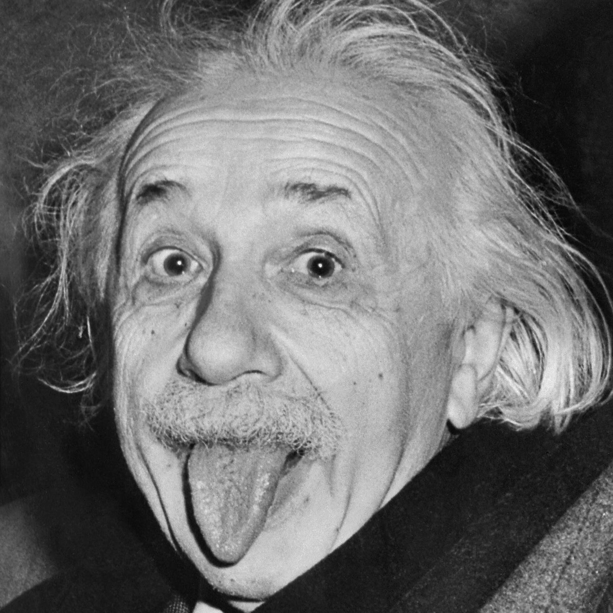

# PyStringArt

PyStringArt is a lightweight, fast python library to generate string art from pictures.

To use, add this repository to your python path, install the dependencies (python-opencv, numpy, matplotlib) and take a look at the `example.py` file.

There, we get from this image:

To something like this:

It can also animate the process:

The results in real life:

